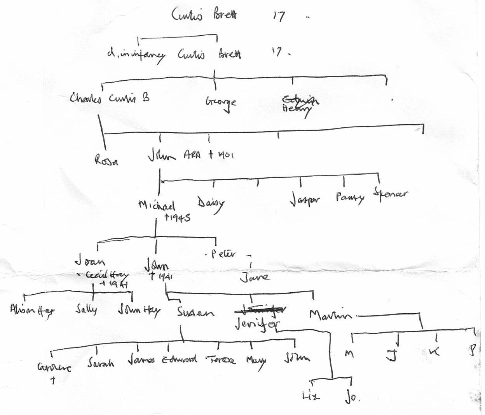

# Brett-Whitehead family history

Notes on the family history, that starts from the marriage of John Brett and
(Margaret) Joy Whitehead, in May 1928 (see below).

John and Joy had three children:

* Sue Oliver
* Jennifer Brooke-Smith
* Martin Brett b 1939-01-06.

## Bretts

This is Martin's sketch of the Brett side of the family tree:



John [died in World War
2](https://www.naval-history.net/xDKCas1941-05MAY2.htm), when his ship [HMS
Gloucester](https://www.naval-history.net/xGM-Chrono-06CL-HMS_Gloucester.htm)
sank, on May 22nd 1941.

From: <http://www.thepeerage.com/p31682.htm#i316813> - John Brett was born on the 27th March 1905, married Margaret Joy Whitehead on 5th May 1928, and was killed in action off Crete in H.M.S Gloucester, on 22nd May 1941.

John was the son of Michael Brett, who was the eldest son of [John Brett, the
painter](https://en.wikipedia.org/wiki/John_Brett_(artist)).

He was commissioned into the Royal Navy on 15 September 1918, and gained these ranks:

* Midshipman: 15 January 1923
* Sub-Lieutenant: 15 November 1925
* Lieutenant: 15 November 1927
* Lieutenant-Commander: 15 November 1935.

Source is Burke's Peerage, and
<http://www.unithistories.com/units_index/default.asp?file=../officers/personsx.html>,
but I can't find John Brett at this link, now or via <https://archive.org>.

John was awarded the Distinguished Service Cross, [announced 11th September
1940](https://www.thegazette.co.uk/London/issue/34943/supplement/5469), and
Mention in Dispatches [announced 17 June
1941](https://www.thegazette.co.uk/London/issue/35191/supplement/3436)

## Whiteheads

### Margaret Joy Whitehead:

<http://www.thepeerage.com/p31682.htm>

Margaret Joy Whitehead was the daughter of Gilbert Hinds Whitehead and Helena
Emmeline Langford. She married John Brett on 5 May 1928, and Robert Clement
Giles on 24th July 1965.

Source is Burke's Peerage.

Marriage: <https://www.freebmd.org.uk>:

```
Type:	 	Marriages	 	Surname:	 	Brett	 	First name(s):	 	John
Start date:	 	Mar 1920	 	End date:	 	Dec 1935	 	Spouse/Mother's surname:	 	Whitehead
Spouse's first name(s):	 	Margaret

Marriages Jun 1928 
Brett 	John 	Whitehead 	Lewisham 	   1d 	2117
```

She died in 1981: <https://www.freebmd.org.uk>

```
Deaths Jun 1981   (>99%)
GILES	 MARGARET JOY	 12JE1905	 SURREY S W	 17	1323
```

According to <http://www.thepeerage.com/p31681.htm#i316808>, Gilbert Hinds
Whitehead was the fifth son of [Sir James Whitehead, 1st
Baronet](https://en.wikipedia.org/wiki/Sir_James_Whitehead,_1st_Baronet) and
Mercy Matilda Hinds.  Further links there say Helena Emmeline Langford was the
daughter of Henry A. Langford, but no mention of her mother. This site claims
she was born on 10 April 1901 and died in 1949.

```
Deaths Dec 1949   (>99%)
Whitehead	 Helena E	 77	 Woolwich	 5d	878	  Scan available - click to view
```

I can't find a birth certificate for Helena or Emmeline Langford, between 1890
and 1910.
