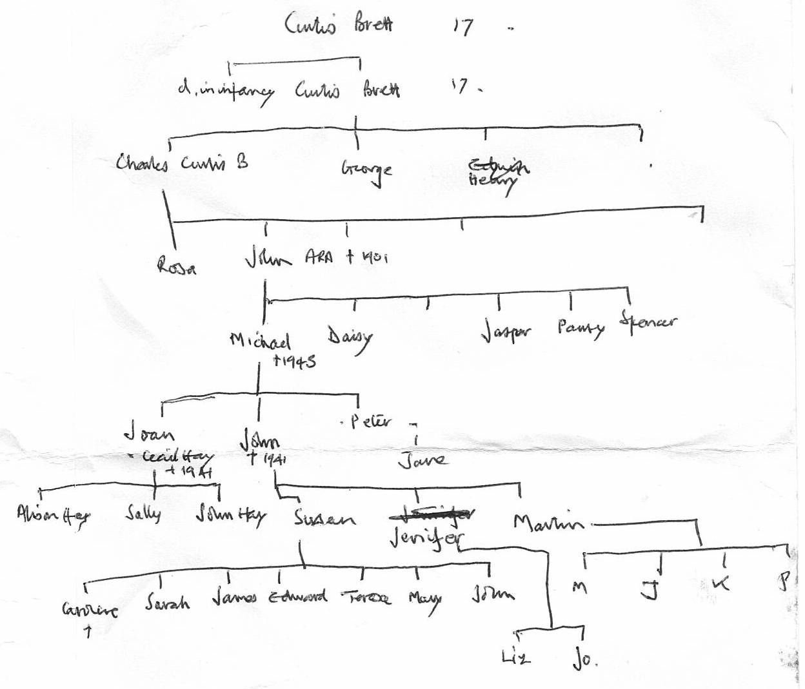

---
# YAML metadata
title: Brett-Whitehead family history
author: Matthew Brett
---

# Brett-Whitehead family history

Notes on the family history, that starts from the marriage of John Brett and
(Margaret) Joy Whitehead, in May 1928 (see below).

John and Joy had three children:

* Sue Oliver
* Jennifer Brooke-Smith
* Martin Brett b 1939-01-06.

For John Brett see [John Brett](john_brett_1905.html)

## Bretts

This is Martin's sketch of the Brett side of the family tree:




### Early Brett family

* Curtis Brett (b ~1720), printer.  [CB wikitree
  entry](https://www.wikitree.com/wiki/Brett-973).  [CB
  will](https://aparcelofribbons.co.uk/wp-content/uploads/2016/03/68-Brett-Will-of-Curtis-Brett-1784.pdf).
  Father of Charles Richard Brett (born and died 1761) and Curtis Brett (b
  1765)
* Curtis Brett (b 1765).  [CB Jr wikitree
  entry](https://www.wikitree.com/wiki/Brett-967). Father of Charles Curtis
  Brett (b 1789).
* Charles Curtis Brett (b 1789). [CCB wikitree
  entry](https://www.wikitree.com/wiki/Brett-986).  Father of John Brett (b 1831).

Charles Curtis Brett's household in the 1851 census.

| Name  | Age | Relation | Profession |
|-------| ----|----------|------------|
| Charles C Brett  | 67 | Head | Vetinary surgeon ?army |
| Ann Brett  | 42 | Wife | |
| Rosa Brett  | 21 | Daughter | |
| John Brett  | 19 | Son | ? landscape ? |
| Theodore Brett  | 17 | Son | Scholar |
| Arthur Brett  | 15 | Son | Scholar at home |
| Edwin Brett  | 10 | Son | Scholar at home |
| Elizabeth Walker  | 47 | Servant | ?house? |

See [CCB 1851 census original image](images/brett_cc_1851_census.jpg)

1851 England census; Class: HO107; Piece: 1617; Folio: 593; Page: 37; GSU roll:
193518


### John Brett (b 1831)

The Dictionary of National Biography (1912) on [John Brett (the
painter)](https://en.wikisource.org/wiki/Brett,_John_(DNB12)). "BRETT, JOHN
(1831–1902), landscape painter, born at Bletchingley, Surrey, on 8 Dec. 1831,
was eldest son of Captain Charles Curtis Brett of the 12th lancers by his wife
Ann Philbrick. [...] He died in his house at Putney on 8 Jan. 1902. He married
in 1870, and had four sons and three daughters who survived him. A portrait in
oils by himself, painted about 1865, belongs to his son, Mr. Michael Brett. "

The current ODNB article (behind a paywall) adds "Captain Charles Curtis Brett
(1789–1865), an army veterinarian" and "Ann Pilbean (b. 1808/9)".  "About 1870
Brett met, and later married, Mary Ann Howcroft (b. 1844/5), with whom he had
seven children, the first being born in either 1871 or 1872. "

There is a Mary Ann Brett at [this MyHeritage.com
page](https://www.myheritage.com/names/mary_howcroft) that appears to match
John's partner and Michael's mother.

[FeeBMD](https://www.freebmd.org.uk) has no record of a marriage between "John
Brett" and someone with surname "Howcroft" between 1840 and 1902.

[Rosa Brett](https://en.wikipedia.org/wiki/Rosa_Brett) was John (the painter's)
older sister.  The ODNB has "Brett, Rosa [pseud. Rosarius] (1829–1882),
painter, was born on 7 December 1829 and baptized at St George's, Camberwell,
Surrey, on 26 March 1830, the eldest of the five children of Captain Charles
Curtis Brett (1789–1865), veterinary surgeon in the 12th lancers, and his wife,
Ann, née Pilbean (b. 1808/9), of Tonbridge, Kent."


### Children of John Brett (b 1831)

The record for John's household in the 1881 census records these household
members at No 6 Keswick Road, London:

| Name  | Age | Relation |
|-------| ----|----------|
| John Brett  | 49 | Head |
| Mary Brett  | 37 | Wife |
| Michael Brett  | 9 | Son |
| Daisy Brett  | 8 | Daughter |
| Jasper Brett  | 6 | Son |
| Alfred J. Brett  | 4 | Son |
| Pansy Brett  | 2 | Daughter |
| Spencer Brett  |   | Son |
| Margaret Reeve  | 22 | Cook |
| Elizabeth Rulings  | 19 | Housemaid |

John's occupation is "Painter (ARA)".

1881 England Census. Class: RG11; Piece: 656; Folio: 128; Page: 30; GSU roll:
1341152

The 1891 census has his address as Daisy Field, and members:

| Name  | Age | Relation |
|-------| ----|----------|
| John Brett  | 59 | Head |
| Mary Brett  | 44 | Wife |
| Michael Brett  | 19 | Son |
| Daisy Brett  | 18 | Daughter |
| Pansey Brett  | 12 | Daughter |
| Spencer Brett  | 10 | Son |
| Gwendoline Brett  | 7 | Daughter |
| Jessie Barrett  | ?67 | Governess |
| Ellen Amor  | 24 | Servant ? cook|
| Ada R Cliffe  | 23 | Housemaid |

The National Archives of the UK (TNA); Kew, Surrey, England; Census Returns of England and Wales, 1891; Class: RG12; Piece: 445; Folio: 94; Page: 4; GSU roll: 6095555

Alfred J Brett appears to be at Winchester, in 1891:

The National Archives of the UK (TNA); Kew, Surrey, England; Census Returns of
England and Wales, 1891; Class: RG12; Piece: 937; Folio: 131; Page: 3; GSU
roll: 6096047

* Michael - [various official
  data](https://en.wikisource.org/wiki/Author_talk:Michael_Brett). There is
  a [page on Michael at
  ancestry.co.uk](https://www.ancestry.co.uk/genealogy/records/michael-brett-24-bym0q).
* Daisy <https://ancestors.familysearch.org/en/LDMW-P94/daisy-brett-1873-1957>
* Jasper <https://ancestors.familysearch.org/en/LDMW-GJ8/jasper-brett-1874-1950>
* Alfred Jeaffreson - see [Alfred Brett Ancestry.com
  page](https://www.myheritage.com/names/alfred_brett).
* [Pansy](https://www.ancestry.co.uk/genealogy/records/pansy-brett-24-bytvy),
  and section at [Pansy Marshall Ancestry.com
  page](https://www.myheritage.com/names/pansy_marshall).
* Spencer <https://ancestors.familysearch.org/en/L8QX-K6X/spencer-brett-1880-1953>
* Gwendoline

Michael's [census record for
1911](https://en.wikisource.org/wiki/Author_talk:Michael_Brett) shows him to be
living in Hangerlea, Stansted Road, Bishop's Stortford, with this household:

| Name  | Age |
|-------| ----|
| Michael Brett | 39 |
| Nellie Mary Brett | 29 |
| Joan Brett | 8 |
| John Brett | 6 |
| Peter Brett | 1 |
| Tirzah Faulder | 25 |
| Caroline Alice Hudgell | 24 |
| Annie Amelia Smith | 27 |

Tentative: Joan Brett [married Alistair William
Hay](https://www.ancestry.co.uk/genealogy/records/joan-brett-24-c2tls) ---
presumably subject of [this
article](https://manifestmagazine.files.wordpress.com/2008/08/manifestn2.pdf).

## Whiteheads

See [extract from Burke's peerage, 1949](images/whitehead_mj_burkes_1949.pdf)
for full summary of Whitehead family tree to 1949.

### Margaret Joy Whitehead:

Quoting from the extract from Burke's peerage above:

>  3. Gilbert Hinds, b. 26 May, 1866 ; to. 10 April, 1901, •Helena Emmeline,
>     (New Raven, Eltham, Kent), only dau. of late Henry A. Langford, of
>     Plymouth, and d. 18 Dec. 1908, leaving issue,
>     * Margaret Joy, m. 5 May, 1928, Lt.-Cmdr. John Brett, D.S.C., R.N., elder
>       son of Michael Brett, of Bishop’s Stortford, and has issue. He was k.
>       in action in H.M.S. Gloucester, off Crete, 22 May, 1941.

1959 edition adds only that Helena Emmeline died in 1949, and address for
Margaret Joy of "Heath Cottage, Puttenham, Guildford, Surrey".

2003 edition (excerpted in [peerage.com summary](http://www.thepeerage.com/p31682.htm) adds that Margaret Joy married Robert Clement Giles on 24th July 1965.

Marriage: <https://www.freebmd.org.uk>:

```
Type:	 	Marriages	 	Surname:	 	Brett	 	First name(s):	 	John
Start date:	 	Mar 1920	 	End date:	 	Dec 1935	 	Spouse/Mother's surname:	 	Whitehead
Spouse's first name(s):	 	Margaret

Marriages Jun 1928 
Brett 	John 	Whitehead 	Lewisham 	   1d 	2117
```

She died in 1981: <https://www.freebmd.org.uk>

```
Deaths Jun 1981   (>99%)
GILES	 MARGARET JOY	 12JE1905	 SURREY S W	 17	1323
```

According to <http://www.thepeerage.com/p31681.htm#i316808>, Gilbert Hinds
Whitehead was the fifth child (and third son) of [Sir James Whitehead, 1st
Baronet](https://en.wikipedia.org/wiki/Sir_James_Whitehead,_1st_Baronet) and
Mercy Matilda Hinds.  Further links there say Helena Emmeline Langford was the
daughter of Henry A. Langford, but no mention of her mother. This site claims
she married Gilbert Hinds on 10 April 1901, and died in 1949. Her age on her
death certificate (from 1949) suggests she was born around 1872:

```
Deaths Dec 1949   (>99%)
Whitehead	 Helena E	 77	 Woolwich	 5d	878
```

Marriage record is very likely to be:

```
Marriages Jun 1901   (>99%)
Whitehead	 Gilbert Hinds	 	 Truro	 5c	237
```

This site about [a gravesite for the Whitehead
family](https://billiongraves.com/grave/Helena-Emmeline-Langford-Whitehead/22444584)
has the following information:


> Gilbert Hinds Whitehead
>
> Third son of Sir James Whitehead. Bart.
>
> Born 26th May 1886, died 18th December 1908
>
> Helena Emmeline, wife of the above
>
> Born 10 May 1872, died 18 Oct 1949

Helena's date of birth tallies with this birth certificate:

> LANGFORD, HELENA  EMMELINE
>
> BRAGINTON
>
> GRO Reference: 1872  J Quarter in PLYMOUTH  Volume 05B  Page 251


In the 1881 census, Helena Emmilina Langford was at 5 North Hills Terrace, in
the following household:

| Name  | Age | Relation | Marriage | Profession |
|-------| ----|----------|----------|------------|
| Clara Louisa Langford  | 42 | Head | Widow | Lady |
| Ellen Macornick Johns  | 22 | Daughter | Single | Lady |
| Richard Braginton Johns  | 18 | Son | Single | Solicitor's articled clerk |
| Helena Emmilina Langford  | 8 | Daughter | Single | Scholar |
| George Stawell Tuckey  | 27 | Visitor | Single | Solicitor |
| Fanny Gent  | 47 | Servant | Single | Cook Domestic |
| Elizabeth Dunn  | 16 | Servant | Single | Housemaid |

See the [HEL 1881 census original image](images/langford_he_1881_census.jpg)

In 1891 Helena is living at 8 Roman Road, Chiswick, with her half-brother, and
one of the same servants, Fanny Gent:

| Name  | Age | Relation | Marriage | Profession |
|-------| ----|----------|----------|------------|
| Edmund A Johns | 26 | Head | Single | Living on own means |
| Helena E Langford  | 18 | Half-sister | Single | Scholar |
| Fanny Gent  | 62 | Servant | Single | Cook Domestic |

The National Archives of the UK (TNA); Kew, Surrey, England; Census Returns of
England and Wales, 1891; Class: RG12; Piece: 1034; Folio: 83; Page: 31; GSU
roll: 6096144

See the [HEL 1891 census original image](images/langford_he_1891_census.jpg)

It looks like Helena is in Truro, as Helena E Langford, for the 1901 survey,
which is also where she married Gilbert Hinds Whitehead.

Search for [Richard Braginton
Johns](https://www.ancestry.com.au/genealogy/records/richard-braginton-johns-24-qy2hdl)
suggests his father was Edmund Allen Johns, who died in 1864, and Clara Louise
Braginton (b 1837).

Edmund Allen Johns married Clara Braginton in 1857:

```
Marriages Mar 1857   (>99%)
Johns	 Edmund Allen	 	 Torrington	 5b	793
```

He died in Truro in 1864:

```
Deaths Dec 1864   (>99%)
Johns	 Edmund Allen	 	 Truro	 5c	113
```

Henry A Langford married Clara Johns in 1866, in Plymouth:

```
Marriages Jun 1866   (>99%)
LANGFORD	 Henry A	 	 Plymouth	 5b	437
```

Apart from Helena Emmeline, there was only one other Langford born in Plymouth
between 1864 and 1890:

```
Births Jun 1868   (>99%)
LANGFORD	 Albert Leonard	  	 Plymouth	 5b	265
```

Albert Leonard Langford died at age 11, also in Plymouth, which would explain
why he is not in Clara Louisa's Household in 1881.

```
Deaths Dec 1879   (>99%)
Langford	 Albert Leonard	 11	 Plymouth	 5b	193
```
